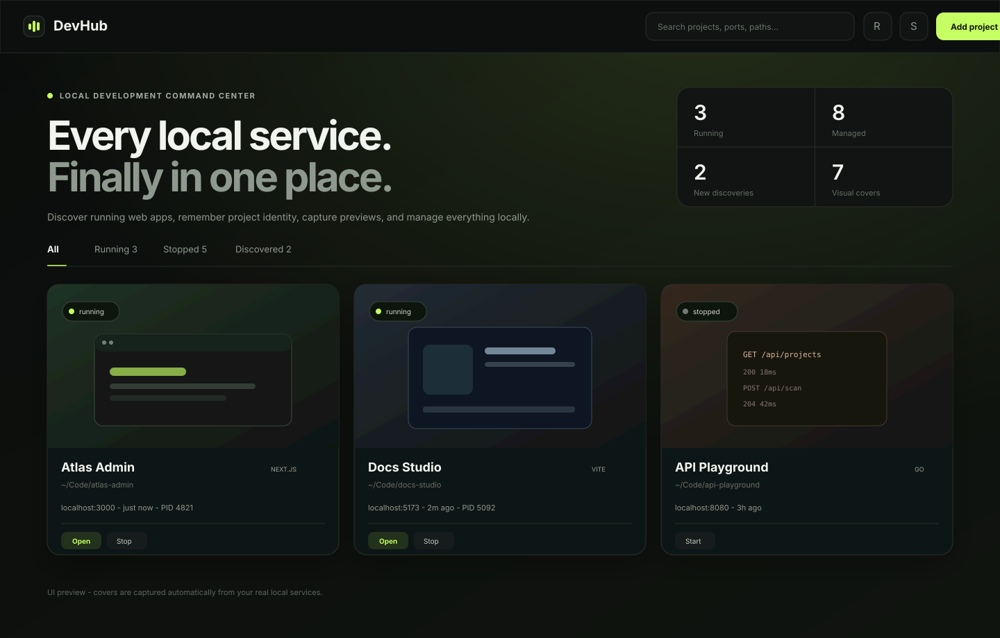

<div align="center">
  <h1>DevHub</h1>
  <p><strong>Your local development services, finally in one place.</strong></p>
  <p>Auto-discover local web apps, remember project identity, capture visual covers, and start or stop projects from one polished dashboard.</p>

  <p>
    <a href="https://github.com/Lcrro/devhub/actions/workflows/ci.yml"></a>
    <a href="LICENSE"></a>
    
  </p>
</div>



## Why DevHub?

When several projects are running at once, `localhost:3000`, `:5173`, `:8000`, and `:8080` stop meaning anything. DevHub turns those ports back into projects you can recognize.

It watches local listening ports, traces them to processes and working directories, recognizes common project manifests and frameworks, and remembers high-confidence development services. If the service exposes a web page, DevHub can use your installed Chromium-based browser to capture a cover automatically.

## Highlights

- **Automatic discovery** - detects listening development services without requiring per-project configuration.
- **Project identity, not just ports** - uses working directories, manifests, runtime signals, and framework hints so a project can survive port changes.
- **Visual covers** - captures 1280x720 previews with Chrome, Chromium, or Edge and refreshes them at most once every 24 hours by default.
- **Start and stop** - remembers inferred or manually configured start commands and manages process trees.
- **Safe discovery flow** - newly discovered services are visible immediately but must be explicitly kept before DevHub can stop or restart them.
- **Persistent memory** - stopped projects remain in the dashboard; forgotten discoveries stay ignored instead of reappearing on the next scan.
- **Zero runtime dependencies** - the dashboard is embedded into a single Go binary. No Node.js or Python installation is required to run DevHub.
- **Local by default** - the management server binds only to `127.0.0.1` and does not enable CORS.

## Quick start

### Build from source

```bash
git clone https://github.com/Lcrro/devhub.git
cd devhub
go build -o devhub ./cmd/devhub
./devhub
```

DevHub opens the dashboard automatically. The default address is:

```text
http://127.0.0.1:17890
```

If that port is already occupied, DevHub selects another local port and prints it to the terminal.

Useful flags:

```bash
devhub --no-open
devhub --port 17890
devhub --data-dir /path/to/devhub-data
devhub --version
```

## How discovery works

DevHub collects local TCP listeners and builds a confidence score from several signals:

```text
listening port
    -> PID and process
    -> working directory
    -> nearest project manifest
    -> framework / runtime hints
    -> local HTTP(S) probe
    -> confidence score
    -> remembered candidate
```

Current manifest hints include `package.json`, `pyproject.toml`, `Cargo.toml`, `go.mod`, `Gemfile`, and `.git`. JavaScript projects can also infer `npm`, `pnpm`, `yarn`, or `bun` start commands from lockfiles and package scripts.

The discovery threshold intentionally excludes common database and infrastructure daemons such as PostgreSQL, Redis, MySQL, MongoDB, and SSH.

## Screenshot covers

When a remembered service exposes an HTTP(S) page, DevHub looks for an installed Chromium-based browser and runs it headlessly. Supported browser discovery includes Chrome, Chromium, and Microsoft Edge on the major desktop platforms.

A missing browser does not prevent DevHub from working; only automatic cover capture is unavailable.

## Platform support

| Platform | Listener discovery | Process control | Cover capture |
| --- | --- | --- | --- |
| Linux | `ss`, with `lsof` fallback | process groups + child termination | Chrome / Chromium / Edge |
| macOS | `lsof` | process groups + child termination | Chrome / Chromium / Edge |
| Windows | PowerShell `Get-NetTCPConnection` | `taskkill /T` | Chrome / Chromium / Edge |

Windows does not expose a reliable working directory for arbitrary processes through the same lightweight mechanism, so identity confidence may rely more heavily on command line and framework signals there.

## Data and privacy

DevHub stores its state and cover images in the current user's configuration directory. The exact location is printed when DevHub starts and can be overridden with `--data-dir`.

State contains local project paths, start commands, ports, and recent process metadata. Covers are screenshots of local web pages. None of this data is uploaded by DevHub.

See [SECURITY.md](SECURITY.md) for the threat model and reporting guidance.

## Development

Requirements:

- Go 1.23 or newer
- A Chromium-based browser if you want to test cover capture
- `ss` or `lsof` on Linux, `lsof` on macOS, or PowerShell on Windows

Common commands:

```bash
make test
make build
make run
make cross-build
```

Architecture notes live in [`docs/architecture.md`](docs/architecture.md), and the discovery scoring model is documented in [`docs/discovery.md`](docs/discovery.md).

## Roadmap

The first release focuses on the core loop: discover -> identify -> remember -> preview -> manage. Likely follow-up areas include project tags, richer log streaming, optional local domains, launch-at-login support, plugin-style framework detectors, and a small CLI for project actions.

## Contributing

Issues and pull requests are welcome. Please read [CONTRIBUTING.md](CONTRIBUTING.md) before proposing larger changes.

## License

MIT. See [LICENSE](LICENSE).
